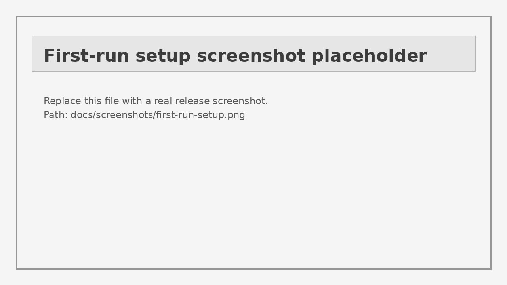
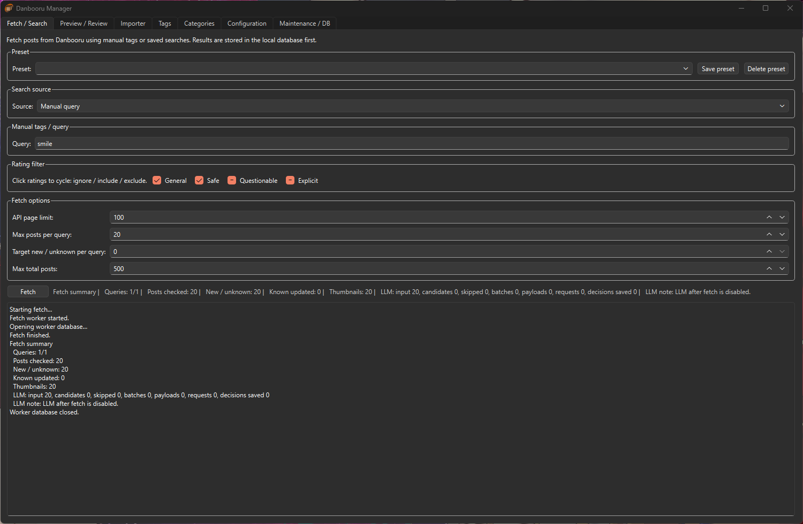
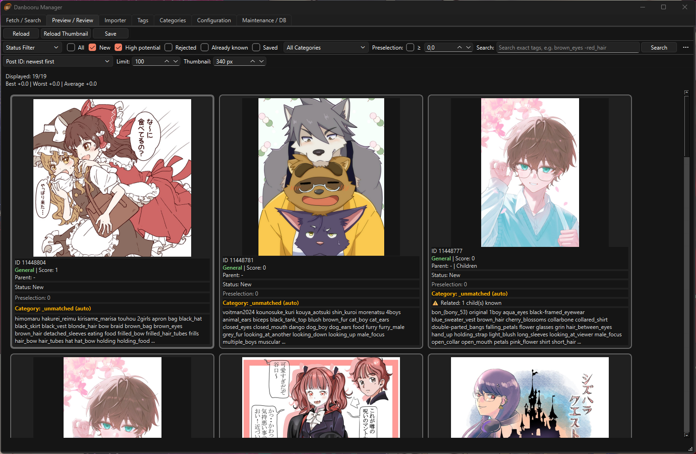
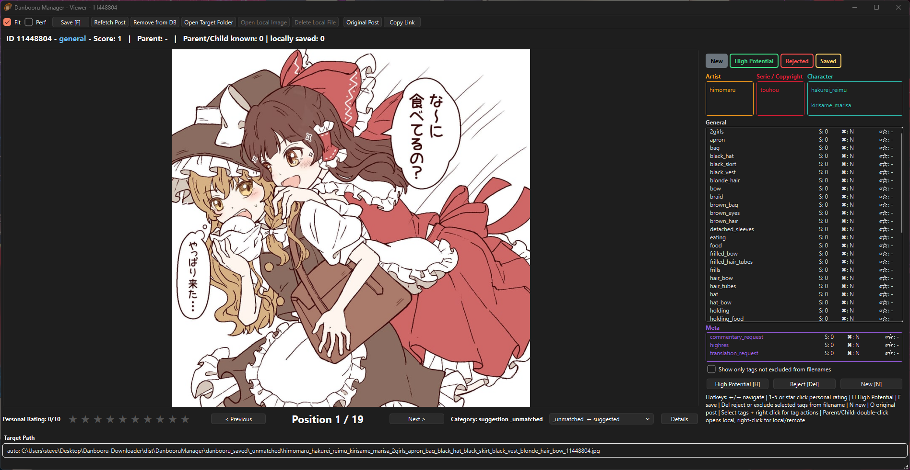

# Danbooru Download Manager

**Version:** `1.3.143`  
**First public release:** `1.3.135`

Danbooru Download Manager is a desktop application for managing local Danbooru downloads with a review-first workflow: fetch metadata and thumbnails, inspect posts in a fast preview grid, rate them, categorize them, and finally save originals into clean local folders.

The project started as a **vibe-coding** experiment. That sounds casual, but the result was still real work: the first release took roughly **150 patches** to reach the current state. Vibe-coding helped with speed and iteration, but without understanding the architecture, database model, GUI flow, packaging behavior, and the Danbooru API, this would have collapsed into spaghetti with buttons.

> ⚠️ This application is not affiliated with Danbooru. Use it responsibly and respect Danbooru's terms, rate limits, and content rules.

---

## 📸 Screenshots

The screenshots below are from Version `1.3.135` Release

| First-run setup | Fetch tab |
|---|---|
|  |  |

| Previewer | Viewer |
|---|---|
|  |  |

---

## ✨ Highlights

- 🗂️ **Local Danbooru download management** with SQLite-backed post, tag, file, rating, and category state.
- 🔎 **Later lookup and search** by tag, post ID, original Danbooru link, status, category, rating, and local metadata.
- 🖼️ **Preview-first workflow**: load metadata and thumbnails first, download originals only when needed.
- ⭐ **Personal rating system** for manual preselection and future learning behavior.
- 🧠 **Learning-oriented recommendation structure** based on saved, rejected, scored, and categorized posts.
- 🤖 **Experimental LLM integration** for preselection and category assistance.
- 🧩 **Categories with auto-assignment**, custom output folders, priority, include/exclude rules, and manual overrides.
- 🏷️ **Structured tag display** for artist, character, copyright, general, and meta tags.
- 📝 **Configurable filename patterns** with typed tag placeholders and post IDs.
- 📥 **Existing file importer** with Danbooru MD5 lookup where possible.
- 📦 **PyInstaller-ready release workflow** for packaged Windows builds.
- 🔄 **Portable GitHub Release updater** for packaged builds, using release ZIP assets while preserving local user data.

---

## 🚀 Typical workflow

1. Start the application.
2. Complete the first-run setup.
3. Configure credentials, folders, categories, filename rules, and preview settings.
4. Use the **Fetch** tab to load posts from manual tags, presets, or Danbooru saved searches.
5. Review posts in the **Previewer**.
6. Open interesting posts in the **Viewer**.
7. Rate, reject, keep, categorize, or save posts.
8. Let the application write final files into category-specific folders.
9. Search and manage local posts later by tag, post ID, status, category, rating, or original Danbooru link.

---

## 📚 Documentation

The README is intentionally kept as an overview. Detailed usage and configuration notes live in `docs/`, because stuffing everything into one README is how documentation turns into a landfill with headings.

| Document | Description |
|---|---|
| [`docs/FIRST_TIME_USAGE.md`](docs/FIRST_TIME_USAGE.md) | First start, optional API key, initial tag catalog import, and sensible tag counts. |
| [`docs/CONFIGURATION.md`](docs/CONFIGURATION.md) | Credentials, folders, filename patterns, categories, preview settings, and runtime data. |
| [`docs/FETCH_WORKFLOW.md`](docs/FETCH_WORKFLOW.md) | How the Fetch tab works, including manual queries, presets, saved searches, limits, and results. |
| [`docs/TESTING.md`](docs/TESTING.md) | How the first release was tested during patch-based development. |
| [`docs/CHANGELOG.md`](docs/CHANGELOG.md) | Generated changelog based on the accumulated patch documentation. |
| [`docs/README_PORTABLE_UPDATER_1_3_141.md`](docs/README_PORTABLE_UPDATER_1_3_141.md) | Portable update workflow through GitHub Release assets. |
| [`docs/README_UPDATE_TAB_1_3_142.md`](docs/README_UPDATE_TAB_1_3_142.md) | Dedicated Updates / Help tab for release checks and future in-app help. |
| [`docs/screenshots/README.md`](docs/screenshots/README.md) | Screenshot placeholder locations and replacement notes. |

---

## 🧪 Testing notes

Development was done in small patches. Each patch was tested for the feature or fix it introduced before moving to the next one. The first public release therefore represents an incremental test history, not one huge untested rewrite dropped into the repository like a suspicious binary meteor.

Testing focused on:

- ✅ GUI startup and first-run behavior
- ✅ database migrations and DB-only configuration handling
- ✅ Fetch tab queries, limits, summaries, and thumbnail loading
- ✅ Previewer filters, sorting, card display options, and structured tags
- ✅ Viewer navigation, rating, category assignment, final filename preview, and save flow
- ✅ category rule matching, priority handling, and category reasoning dialogs
- ✅ tag catalog import, autocomplete, aliases, scoring, and filename exclusions
- ✅ existing file import and Danbooru MD5 lookup behavior
- ✅ PyInstaller path handling and packaged Windows runtime behavior
- ✅ English UI/documentation pass for the public release

More details are available in [`docs/TESTING.md`](docs/TESTING.md).

---

## 🤖 LLM integration: experimental

The LLM integration can prepare compact post payloads and ask a configured backend to help with preselection or category suggestions.

Depending on configuration, payloads can use raw tags, aliases, normalized tags, or privacy-oriented transformed tag data. The goal is to provide useful decision hints while keeping the workflow local-first and controllable.

This feature is experimental in version `1.3.135`. Treat it as assistance, not truth handed down from a silicon oracle with questionable taste.

---

## 🛠️ Installation from source

Requirements:

- Python 3.11 or newer recommended
- Windows or Linux desktop environment
- dependencies from `requirements.txt`

```bash
python -m venv .venv
source .venv/bin/activate
pip install -r requirements.txt
python main.py
```

On Windows PowerShell:

```powershell
python -m venv .venv
.venv\Scripts\Activate.ps1
pip install -r requirements.txt
python main.py
```

The GUI starts by default when no CLI action is given.

---

## 📦 Building a Windows executable

The repository contains PyInstaller-oriented build support.

```powershell
.\scripts\build_windows.ps1
```

Packaged builds should keep runtime data next to the executable, so a portable release can keep its database, thumbnails, settings, and logs together.

Packaged builds also include `DanbooruManagerUpdater.exe`. The updater is launched from `Help -> Check for updates...`, downloads the newest Windows ZIP asset from GitHub Releases, replaces program files and preserves local data such as the database, thumbnails, logs and update cache.

Release ZIP files should be uploaded as **GitHub Release assets**, not committed to the repository. GitHub has a 100 MB normal Git file limit, and your release ZIP will probably trample over it like a very confident elephant.

---

## 📁 Repository layout

```text
app/
  core/          database, config, filenames, categories, paths
  danbooru/      Danbooru API and thumbnail cache
  gui/           PySide6 windows, tabs, viewer, preview grid
  i18n/          translation helpers and UI language support
  services/      fetch, import, final save, LLM payloads, tag catalog

docs/            user docs, patch notes, changelog, screenshots
scripts/         build and release helper scripts
main.py          application entry point
```

---

## 📜 License

See [`LICENSE`](LICENSE).
