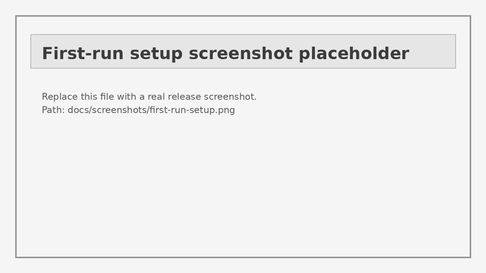
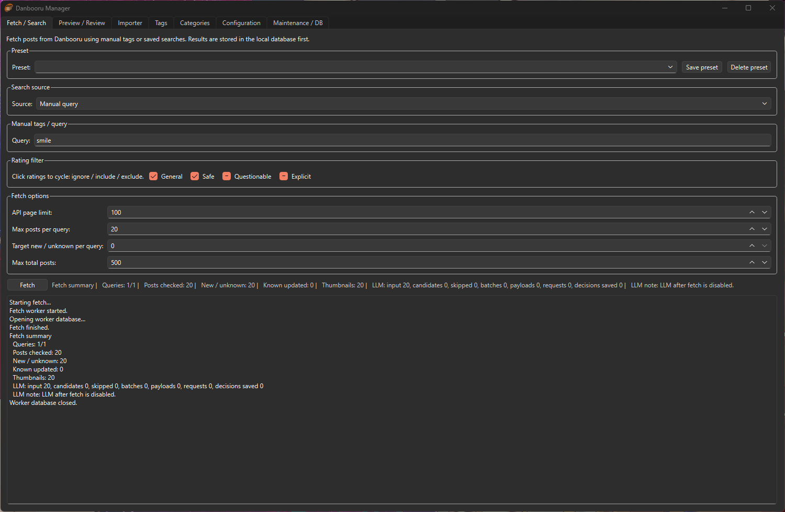
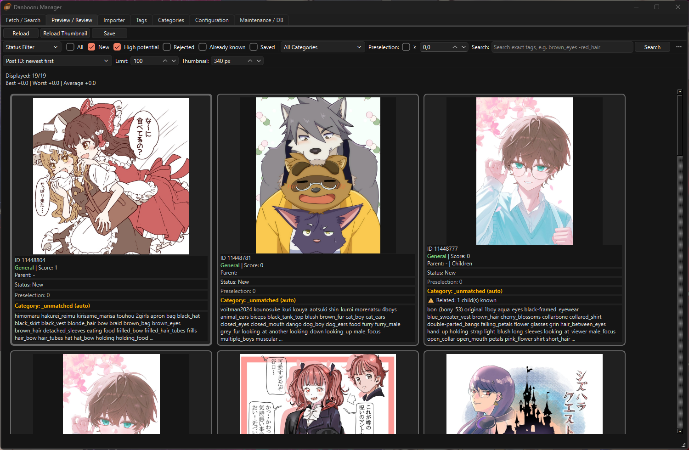
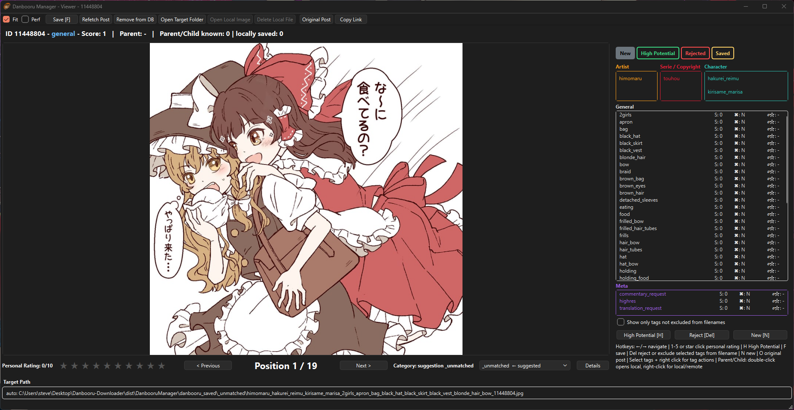

# Danbooru Download Manager

> **Current release:** `1.3.205`
> Version `1.3.205` removes the remaining per-post metadata loop from large filtered Viewer result sets and expands end-to-end performance diagnostics. Development after this release includes the first independent Docker web application.
> A local Danbooru collection manager for fetching, reviewing, importing, rating, categorizing and organizing posts with a database-backed workflow.

Danbooru Download Manager is a Windows-oriented desktop application for managing a Danbooru image collection. On first start it can use either its local SQLite database or the authenticated Desktop API of a Docker-hosted web installation. Metadata, thumbnails, ratings, statuses, categories, tag settings and file locations stay together instead of being scattered across filenames and folders.

The central workflow is deliberately metadata-first:

1. Fetch post metadata and thumbnails.
2. Review candidates in the Previewer.
3. Inspect and rate posts in the Viewer.
4. Download or save only the files worth keeping.
5. Import existing collections through a separate scan-and-review workflow.

---

## Highlights

- **Database-backed local library**  
  Track pending, saved, rejected, imported and downloaded posts, including tags, ratings, categories, parent/child information and local file paths.

- **Fetch presets and saved searches**  
  Use manual Danbooru queries, reusable presets or authenticated saved searches with per-preset limits, rating selection, optional LLM processing, original-resolution limits and an early stop after consecutive known posts.

- **Controllable Fetch runs**
  Cancel a running Fetch without discarding completed database work. Cancellation also prevents or stops optional LLM follow-up processing between batches.

- **Fetch exclusion blacklist**  
  Exclude unwanted tags before posts enter the database or thumbnail cache. Tags can be added through the Viewer or managed in the Tag tab.

- **Previewer and Viewer workflow**  
  Filter, sort and search fetched posts, then rate, categorize, reject, save or inspect them in detail. Viewer navigation covers the complete matching result set instead of only the currently visible Preview cards.

- **Three-step importer**  
  Scan a folder, review likely matches, compare local and remote images, then choose the final import actions such as renaming and thumbnail fetching.

- **Importer identity checks**  
  Resolve files by post ID first, verify the actual file MD5 against Danbooru, then fall back to calculated file-MD5 lookup for missing/mismatched IDs or foreign-board filenames. Exact ID+MD5 or MD5 matches ignore filename tags and still compare local versus remote resolution.

- **Side-by-side import comparison**  
  Compare local and Danbooru images directly, navigate with buttons or arrow keys, and manually mark candidates as Match or Mismatch.

- **Resolution-aware workflows**  
  Prevent unsuitable posts from entering Fetch results and replace lower-resolution imported files with Danbooru's best available version.

- **Categories and rule groups**  
  Automatically suggest categories through grouped include/exclude rules while preserving manual control in the Viewer.

- **Tag tools and scoring**  
  Manage aliases, manual scores, filename exclusions, fetch exclusions and typed tag groups. Parent/child alternatives are isolated from preference learning after one family member is saved.

- **Concurrent database access**  
  A process-wide FIFO write coordinator serializes Fetch, Importer and Configuration writes while read-only Previewer queries remain available through SQLite WAL mode.

- **Optional experimental LLM support**  
  Build compact tag-based payloads for assisted preselection and category suggestions. Manual decisions remain authoritative, because outsourcing taste entirely to a probability engine would be a rather bleak hobby.

- **Portable Windows release and updater foundation**  
  Release builds can check GitHub releases and update while preserving local application data.

---

## Screenshots

### First-time setup



### Fetch tab



### Previewer



### Viewer



---

## Quick start

### Release build

Download the ZIP for your operating system from the GitHub release, extract it completely, then run the application from the extracted folder.

Windows builds contain:

```text
DanbooruManager.exe
```

Linux builds contain:

```text
DanbooruManager
```

Do not start the application from inside the ZIP. Operating systems already invent enough filesystem folklore without assistance.

### From source

```bash
python main.py
```

Install dependencies first:

```bash
pip install -r requirements.txt
```

### Web application from source

The web interface is an independent runtime, not a webserver embedded into the desktop application:

```bash
pip install -r requirements-web.txt
python web_main.py
```

Open `http://127.0.0.1:8765`. See [Web application](docs/WEB_APP.md) for Docker, volume and shared-database details.

For year-based archives, mount the complete archive through `DANBOORU_ARCHIVE_DIR` and set `DANBOORU_OUTPUT_DIR` to a container path such as `/archive/2026`. Existing posts keep their stored locations when the output year changes.

The web application also includes a dedicated slideshow tab. Slideshow filters use spaces or `+` for AND, `-tag` for exclusions and commas for OR groups. For example, `1girl +smile -nude` requires both positive tags and excludes `nude`, while `1girl, 2girls` accepts either tag. The interval and sequential/random order are configurable and retained by the browser. Left click returns to slideshow history and right click advances. `Delete` removes an existing final file, clears its stored path, rejects the post and advances. Dedicated controls open the original post, toggle path/metadata/tags and open the current post in the full Viewer.

The web Viewer mirrors the desktop Manager's working layout with typed tags on the right, a nearby-post thumbnail strip below the image and controls for status, rating and category. Category rules provide the same automatic suggestions in Preview and Viewer, while a manual Viewer selection is stored as an override. Its Fit mode contains both portrait and landscape media within the available image area. Status changes can automatically advance to the next filtered post through a persisted Viewer checkbox, while a short review history keeps accidentally rejected posts reachable for correction. Right-clicking a tag opens the shared filename-exclusion and scoring/usage actions and applies the confirmed stored state immediately. The desktop shortcuts are available as well, including final saving with `F` through the same archive service. Its navigation still covers the complete active filter result rather than only the currently loaded Preview batch. The web Preview offers combinable desktop-style status and Danbooru-rating filters, the desktop sort set, live Preselection values and summary, persisted filter/sort/search settings, 50-200 item loading batches and adjustable 120-600 px thumbnails. Cards use single-click selection, Shift-click range selection and double-click Viewer opening for transactional bulk status changes, including selections spanning many endless-scroll batches. Selected Preview cards accept the desktop action shortcuts: `H` for Potential, `N` for New, `G` for Saved, `K` for Known, `Delete` for Rejected and `F` for final bulk saving; `Ctrl+A` selects all currently loaded cards. Score-relevant tag queries and a short-lived ranking cache keep Preselection sorting responsive across endless-scroll batches; status and save actions update that cache without rebuilding the complete ranking. Lightweight media lookups, direct cache filenames and browser caching keep large thumbnail batches responsive. The Fetch tab reads and manages the same SQLite-backed presets as the desktop application. Automatic Fetch requires one of these saved presets and reloads it for every run. A persistent history shows each run and its seen, new, known and excluded post counts per query.

Known parents, the current post and known children appear side by side in a separate Viewer family strip. Each related post shows its review status and whether a full local file is already available. Filename exclusions remain visible as compact tag flags without crossing out the tag text; the filename-only checkbox can still hide excluded tags. The Preview search completes the current tag token from the local database, supports keyboard selection and preserves exclusion prefixes such as `-`.

On phones, the Viewer uses a touch-focused layout with horizontal swipe navigation and large Reject, Save and Potential actions directly below the image. Each mobile action advances to the next matching post; the action row is omitted once a final file is stored, while category selection and the complete typed tag view remain available below. Viewer images support cursor-centered mouse-wheel zoom on desktop and two-finger pinch zoom on touch screens; zoomed images can be dragged and double-clicking resets the view.

### Docker web application

```bash
docker compose up --build
```

The container runs as `1000:1000` by default. Bind-mounted data directories must be writable by that UID/GID; `PUID` and `PGID` can override it when needed.

### Building releases

Portable folder-style build for the current platform:

```bash
python scripts/make_release.py --allow-dirty
```

Single-executable build for the current platform:

```bash
python scripts/make_release.py --allow-dirty --onefile
```

Release ZIPs are written to `release/` and include the platform and bundle type in the filename, for example `DanbooruManager_1.3.205_win64_portable.zip` or `DanbooruManager_1.3.205_linux_x86_64_onefile.zip`.

---

## First-time setup

On first start, the desktop application first asks for its data source:

- **Local** creates and uses the SQLite database and media directories on this computer.
- **Remote Docker** connects to the Docker server URL and requires its `DANBOORU_DESKTOP_API_TOKEN`. SQLite remains inside the container; the desktop never opens the database file over a network share.

The selection can later be changed under **Config > Base > Data source** and takes effect after restarting the desktop application. The local connection profile, including its API token, is stored in `danbooru_manager_data/desktop_connection.json`.

For a local data source, the remaining setup can configure:

- Danbooru username and API key,
- Danbooru base URL,
- initial import of popular Danbooru tags,
- the default sample post,
- initial access to the existing-file importer.

Authenticated access is recommended for saved searches and account-specific API features. The default sample post is Danbooru post `11199825`.

In Remote Docker mode, Preview, Viewer, status, rating, category, tag and final-save changes are performed on the server. Pressing `F` in the desktop Viewer saves the final file into the Docker archive mount (`/archive`, normally `danbooru_saved`) and records it in the server database. The desktop may keep a temporary local display copy in its Viewer cache, but that copy is not the final archived file. Fetch is started or scheduled in the web interface. The existing-file importer remains local-only because the server cannot access arbitrary folders on the desktop computer.

See [`docs/FIRST_TIME_USAGE.md`](docs/FIRST_TIME_USAGE.md).

---

## Fetch workflow

The Fetch tab discovers posts and stores metadata and thumbnails before original files are downloaded.

A fetch preset can contain:

- a manual tag query or saved-search selection,
- General, Sensitive, Questionable and Explicit rating choices,
- maximum posts per query and total posts,
- minimum unknown posts per query,
- maximum consecutive known posts before the current query is stopped,
- LLM enable state,
- minimum and maximum width and height.

Empty resolution fields or `0` mean unrestricted. Posts outside active limits are rejected before database insertion and thumbnail download.

The persistent **Fetch exclude** list acts as a tag blacklist. Any post containing an excluded tag is skipped before it enters the local review workflow.

Set **Known posts in a row** to stop an individual query after that many consecutive database-known posts. Finding a new post resets the counter. `0` disables this behavior. A running Fetch can be cancelled from the Fetch tab; completed post updates remain stored, and cancellation takes effect after the current network operation.

See [`docs/FETCH_WORKFLOW.md`](docs/FETCH_WORKFLOW.md).

---

## Previewer and Viewer

The Previewer is the main triage view. It supports status filters, text search, sorting, configurable card information, structured tag display and category/recommendation information.

The Viewer opens the complete result set represented by the active Previewer statuses, search, category filter, recommendation threshold and sorting. The Preview card limit only controls how many cards are displayed and no longer limits Viewer navigation. Navigation IDs are loaded independently from card details, while the Previewer fetches full metadata only for visible cards and renders them progressively.

The Viewer provides the detailed decision workflow:

- inspect the image and typed tags,
- assign a personal rating,
- set status,
- choose or override a category,
- inspect category reasoning,
- edit tag aliases and scores,
- exclude tags from filenames or future fetches,
- save the final original file.

Window and toolbar layouts are recalculated after startup and tab changes to avoid controls being pushed outside the visible area.

---

## Importing existing collections

The importer uses a three-step workflow:

1. **Import Source**  
   Select folder, category and subfolder handling, then scan.
2. **Review**  
   Filter Match, Questionable and Mismatch candidates; inspect thumbnails; compare images; select rows and import checkboxes.
3. **Import Process**  
   Choose final actions such as renaming, updating existing records and fetching thumbnails.

The scanner can:

- recognize Danbooru post IDs and MD5 hashes in filenames, with calculated file-MD5 fallback,
- compare every recognized filename tag with the fetched Danbooru post,
- preserve hyphenated tags such as `one-piece_swimsuit` and `chain-link`,
- detect probable Konachan or other foreign-board ID collisions,
- compare local and remote image dimensions,
- show local and remote thumbnails,
- open either file externally,
- compare both images side by side,
- replace a lower-resolution local file with Danbooru's best version,
- rename only the latest import instead of an entire category,
- optionally fetch thumbnails during import.

See [`docs/IMPORTER.md`](docs/IMPORTER.md).

---

## Categories and rules

Category rules are organized as OR-connected groups. Terms inside a group are AND-connected, with `-tag` used for exclusions.

```text
Group A: tag1 tag2 -tag3
Group B: tag4 tag5
```

This means:

```text
(tag1 AND tag2 AND NOT tag3) OR (tag4 AND tag5)
```

The first matching category follows category priority, but the Viewer can override the result manually.

---

## Database behavior

SQLite runs in WAL mode. Each worker owns its own connection, while a central FIFO coordinator serializes writes from Fetch, Importer, Configuration and other mutating workflows.

Read-only Previewer requests remain concurrent. GUI settings are written through background workers where necessary, and the Preview tag identity path is intentionally read-only to prevent stale write slots between repeated Fetch runs.

See [`docs/DATABASE_ACCESS.md`](docs/DATABASE_ACCESS.md).

---

## Documentation

| Document | Purpose |
|---|---|
| [`docs/FIRST_TIME_USAGE.md`](docs/FIRST_TIME_USAGE.md) | First start and initial setup |
| [`docs/CONFIGURATION.md`](docs/CONFIGURATION.md) | Database-backed application settings |
| [`docs/FETCH_WORKFLOW.md`](docs/FETCH_WORKFLOW.md) | Queries, presets, limits, ratings, exclusions and resolution filtering |
| [`docs/IMPORTER.md`](docs/IMPORTER.md) | Existing-file scan, review, comparison and import workflow |
| [`docs/DATABASE_ACCESS.md`](docs/DATABASE_ACCESS.md) | SQLite connection and write-coordination model |
| [`docs/TESTING.md`](docs/TESTING.md) | Functional testing scope and limitations |
| [`docs/RELEASE_WORKFLOW.md`](docs/RELEASE_WORKFLOW.md) | Push, build and release workflow |
| [`docs/CHANGELOG.md`](docs/CHANGELOG.md) | Milestone-oriented project history |
| [`docs/RELEASE_NOTES_1.3.205.md`](docs/RELEASE_NOTES_1.3.205.md) | Changes included in this release |

---

## Planned improvements

- more task-oriented user documentation,
- broader Help-tab coverage and tooltips,
- additional quality-of-life improvements,
- more LLM validation and provider testing,
- optional list-oriented library views.

---

## Notes

- Keep backups of important local collections and the application database.
- Do not publish a database containing credentials.
- Treat LLM output as a suggestion.
- The application is primarily tested on Windows.
